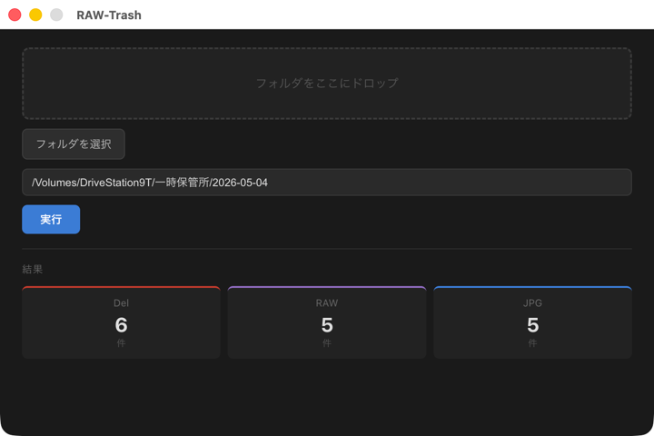

# RAW-Trash

カメラで撮影した RAW ファイルと JPG ファイルのペアを管理・整理する macOS デスクトップアプリケーション。

対応する JPG が存在しない RAW ファイルを `Del/` フォルダに移動し、残りのファイルを `RAW/` / `JPG/` に自動分類します。



## 機能

- **ドラッグ&ドロップ** でフォルダを指定
- **ダイアログ** または **テキスト直接入力**（絶対パス）でフォルダを指定
- 孤立した RAW ファイル（対応 JPG なし）を `Del/` に自動移動
- RAW / JPG を別フォルダに分類
- 処理結果（件数）をリアルタイム表示

## 対応 RAW フォーマット

| 拡張子 | メーカー |
|--------|----------|
| `.ARW` | Sony |
| `.ORF` | Olympus |
| `.CR3` / `.CR2` | Canon |

大文字・小文字どちらも認識します。

## 動作環境

- macOS（Apple Silicon）
- Node.js v18 以上

## 開発

```bash
# 依存関係インストール
npm install

# 開発モード起動
npm start

# lint
npm run lint
```

## ビルド・インストール

```bash
npm run M系Macビルドインストール
```

ビルド後、`/Applications/RAW-Trash.app` に自動インストールされます。

## 技術スタック

- [Electron](https://www.electronjs.org/) + [React](https://react.dev/)
- TypeScript / Webpack
- [Electron Forge](https://www.electronforge.io/)
